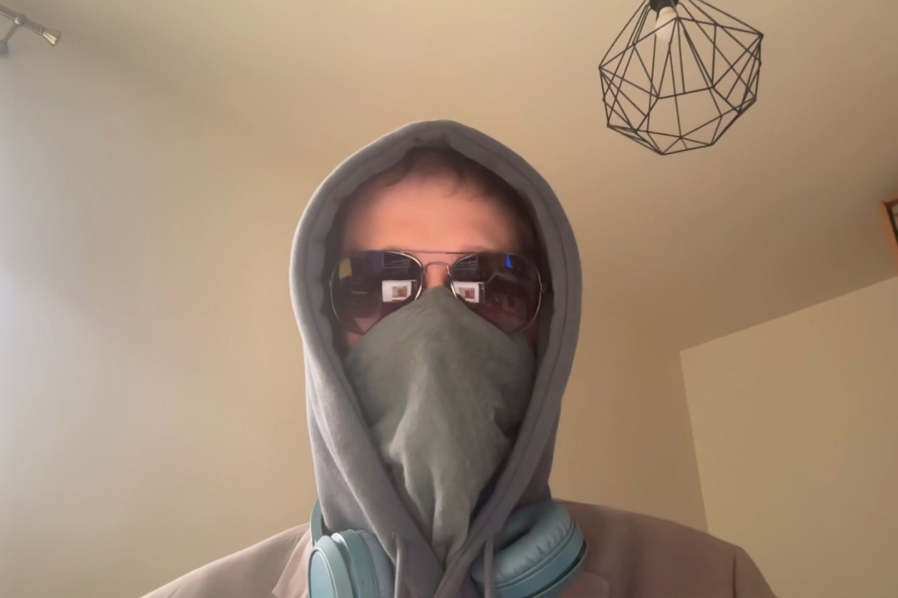

# propozycja
Znamy się tylko trochę, czy potrafię przeskoczyć przez płonącą obręcz?

1. Looknąć na siebie z daleka - mężczyźni to wzrokowcy, podejść i... nie wiem.
   Tak na prawdę jestem nieśmiały bez wspomagania. Rzucam - już nie... I tak zazwyczaj spotykamy się jakby w trakcie.
2. Chcę mieć rodzinę... Ale nie byle jaką!
3. Jestem technikiem informatykiem. Jak widać nie pomaga mi to zarobić, na kurwy, bo przecież sobie bym poszedł do burdelu rano i wieczorem ;)
4. Mów mi jak chcesz.
5. Dla wszystkich miłośników tajnych depesz i listów pisanych atramentem widocznym jedynie w świetle księżyca - [Nutek Cipher](https://github.com/NutekSecurity/nutek-cipher/releases/tag/v1.0.2) - świeżutko z pieca
   
